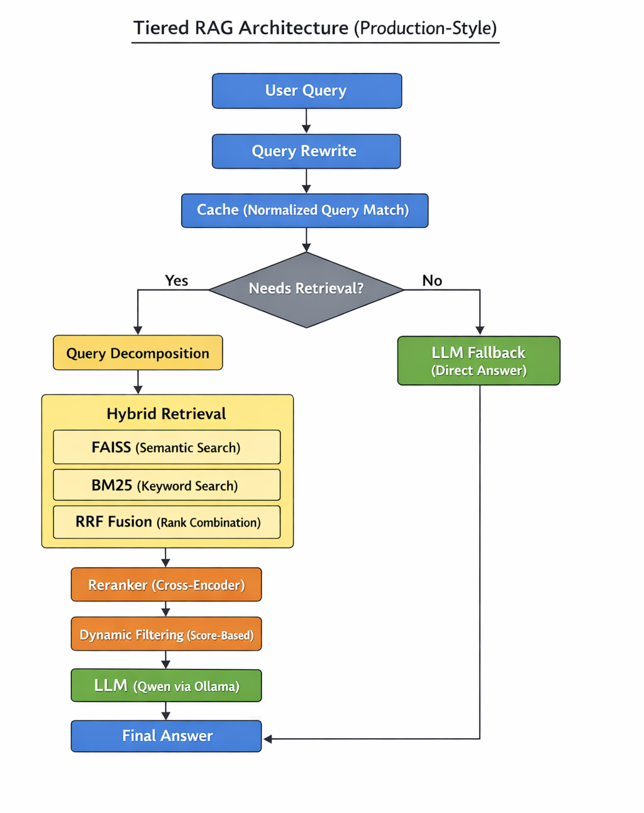

# 🚀 Tiered RAG System with Evaluation & Explainability

## 🚀 Overview

This project implements a **production-style Retrieval-Augmented Generation (RAG) system** using LangGraph.

It includes hybrid retrieval, reranking, evaluation, and explainability to build a robust and debuggable AI system.

## 🏗️ Architecture Diagram

  

---

## 🌟 Key Highlights

* Built a multi-stage RAG pipeline with routing and hybrid retrieval  
* Implemented reranker-based filtering to improve context quality  
* Designed evaluation framework using RAGAS metrics  
* Added observability (logging) for debugging retrieval behavior  
* Built explainable system showing retrieved chunks and scores  

---

## 🚨 Key Problem Solved

### Retrieval Bias in Multi-Query RAG

Initial implementation of query decomposition caused **only the first query to dominate retrieval results**, leading to poor context diversity.

### ✅ Solution

Implemented **adaptive balanced retrieval**, ensuring fair document contribution from each query.

### 📈 Impact

* Improved context diversity  
* Enabled proper multi-intent handling  
* Increased context precision (from ~0.0 → 0.1+)  

---

## ⚙️ Features

* Query rewrite & routing  
* Hybrid retrieval (FAISS + BM25)  
* Reciprocal Rank Fusion (RRF)  
* Cross-encoder reranker  
* Dynamic filtering  
* Local LLM (Qwen via Ollama)  
* RAGAS evaluation framework  
* Streamlit dashboard  
* Explainability (retrieved chunks + scores)  

---

## 🔄 Pipeline

    User Query  
    → Query Rewrite  
    → Cache (Normalized Query Match)  
    → Router (RAG vs LLM)  
    → Query Decomposition  
    → Hybrid Retrieval (FAISS + BM25 + RRF)  
    → Reranker  
    → Dynamic Filtering  
    → LLM (Qwen)  
    → Final Answer  

    The router determines whether a query requires retrieval (RAG pipeline) or can be answered directly using the LLM (fallback), avoiding unnecessary retrieval for queries that can be answered directly by the LLM.

---

## 📊 Evaluation

Metrics used:

* Faithfulness  
* Answer Relevancy  
* Context Precision  
* Context Recall  

### 📈 Results

| Metric | Score |
|--------|------|
| Faithfulness | 0.70 |
| Answer Relevancy | 0.67 |
| Context Precision | 0.10 |
| Context Recall | 0.80 |

---

## 📈 Dashboard

Built using Streamlit to visualize:

* Metrics distribution  
* Failure analysis  
* Query-level inspection  
* Retrieved chunks with scores  

---

## 🔍 Explainability

* Displays retrieved chunks used for answering  
* Shows reranker scores for each chunk  
* Helps debug why a specific answer was generated  

---

## 📁 Project Structure

tiered-rag-system/  
├── api/  
├── rag/  
├── evaluation/  
├── config/  
├── README.md  
├── requirements.txt  

---

## 🛠️ Tech Stack

* LangGraph  
* FAISS  
* BM25  
* SentenceTransformers (BGE models)  
* Ollama (Qwen 7B)  
* RAGAS  
* Streamlit  

---

## 📚 Data Source

This project uses research papers from arXiv as the knowledge base for retrieval.

Documents were preprocessed into chunks and indexed using FAISS for semantic search and BM25 for keyword-based retrieval.

---

## ⚙️ Setup

### 1. Install dependencies

pip install -r requirements.txt

### 2. Start Ollama (Qwen model)

ollama run qwen2.5-coder:7b

---

## 🚀 How to Run

### Start API

uvicorn api.main:app --reload

### Run Evaluation

python evaluation/run_eval.py

### Launch Dashboard

streamlit run evaluation/dashboard.py

---

## 🧪 Example Output

**Question:** What is attention?  

**Answer:**  
Attention is a mechanism that allows models to focus on important parts of the input sequence.

**Retrieved Chunks:**

* Score: 0.073 → "Attention allows models to focus on relevant tokens..."  
* Score: 0.053 → "Self-attention enables relationships between words..."  

---

## ⚠️ Note

* Vector store and raw data are excluded due to size (~GBs)  
* This project focuses on system design, retrieval quality, and evaluation  

---

## 🏭 Production Considerations

* Query caching to reduce redundant computation and latency  
* Hybrid retrieval for better recall across semantic and keyword search  
* Reranking + dynamic filtering to improve context precision  
* Modular pipeline design using LangGraph for extensibility  

---

## 🎯 Future Improvements

* Better dataset alignment for improved precision  
* Stronger reranker for improved ranking quality  
* Latency tracking and optimization  
* Multi-run evaluation comparison  
* Deployment on cloud (GCP / Docker)  

---

## 🧠 Key Learnings

* RAG performance depends more on **ranking quality than retrieval**  
* High recall with low precision leads to noisy context  
* Multi-query systems require balanced retrieval strategies  

---

## 👨‍💻 Author

Santhosh Gaddam  
AI/ML Engineer | Building Production-Ready RAG & LLM Systems